# Bimble
## Github URL
https://github.com/huseinnashr/bimble

## Requirements
### Functional
    F1. User can create new account with an email (Implemented)
    F2. User can verify its newly created account's email
    F3.1. Existing user can login with email and password (Implemented)
    F3.2. System can authenticate user on authenticated endpoint
    F4. Authenticated user can customize their dating profile (OOS but MVP)
    F5. Authenticated user can set their dating preferences (OOS but MVP)
    F7. Authenticated user can see list of personalized dating profiles (OOS but MVP)
    F8. Authenticated user can pass a dating profile
    F9. Authenticated user can like a dating profile
    F10. Regular User is limitted to 10 pass+like per day
    F11. Authenticated user won't be able to see the same dating profile in the same day
    F12.1 Regular user can purchase premium packagees which unlock one premium feature of their choosing. The features are:
    - No swipe quota
    - Verified label
    F12.2 System can verify the purchase payment

## System Design
### Tech Stacks
    Go 
    - as programming language. 
    - Simple, Fast, Compile time type checking. Suitable for rapid development.

    Proto driven HTTP endpoint
    - for defining and generating api docs
    - Can generate both server stub and OpenAPI spec

    Mockery
    - for unit test
    - Can generate mock both internal and 3rd party library. Mock with dependency injection not monkey patching

    PostgreSQL 
    - for storing transactional data that require ACID or persistent
    - Open source, community driven, and matured ecosystem.

    Redis 
    - for storing login session and profile view
    - The goto in-memory datastructure store. Great API, mature ecosystem, reliable

    Kafka
    - notifying when account, profile, preference changes
    - persistent, ordered, scalable, and great ecosystem
    - can rebuild elasticsearch index from the kafka when needed 

    Elasticsearch
    - for storing and distributing dating profile that support personalization, re-ranking and boosting certain profile
    - The goto indexing engine for content recommendation. Great API, mature ecosystem, reliable 

    Github Action
    - CI/CD Workflow
    - integrate natively with github. Many community based 'action' that we can use in our pipeline

    K8s
    - Deployment environment
    - Cloud native, mature ecosystem, easier to setup CI/CD, as well as managing resources such as postgreSQL, redis, elastic

### Endpoints
These endpoints loosely follow https://google.aip.dev/1 api guidelines. The endpoints numbering matche with corresponding functional requirement.

    F1. POST /accounts:signup
    - Request
        Body {email: string, password: string}
    - Response OK 
        Body {message: string}

    F2. POST /accounts:verify
    - Request
        Body {token: string}    
    - Response OK 
        Body {message: string}

    F3.1. POST /accounts:login
    - Request
        Body {email: string, password: string}
    - Response OK 
        Body {token: string}

    F4. PATCH /accounts/profiles
    - Request
        Header {Authentication: Bearer $token}
        Body {Profile}
    - Response OK 
        Body {message: string}

    F5. PATCH /account/preference
    - Request
        Header {Authentication: Bearer $token}
        Body {Preference}
    - Response OK {message: string}

    F6. GET /profile:random
    - Request
        Header {Authentication: Bearer $token}
    - Response OK 
        Body {array of Profile}

    F7. GET /profile:personalized
    - Request
        Header {Authentication: Bearer $token}
    - Response OK 
        Body {array of Profile}
    
    F8. POST /profile/{profile_id}:pass
    - Request
        Header {Authentication: Bearer $token}
    - Response OK 
        Body {message: string}

    F9. POST /profile/{profile_id}:like
    - Request
        Header {Authentication: Bearer $token}
    - Response OK 
        Body {message: string}

    F11. POST /profile/{profile_id}:view
    - Request
        Header {Authentication: Bearer $token}
    - Response OK 
        Body {message: string}

    F12.1. POST /feature/{feature_id}:purchase
    - Request
        Header {Authentication: Bearer $token}
    - Response OK 
        Body {payment_url: string}

    F12.2. POST /payment:confirmation
    - Request
        Header {Authentication: Bearer $token}
        Body {payment_token: string}
    - Response OK 
        Body {message: string}

### Entity Relation
#### PostgreSQL Table
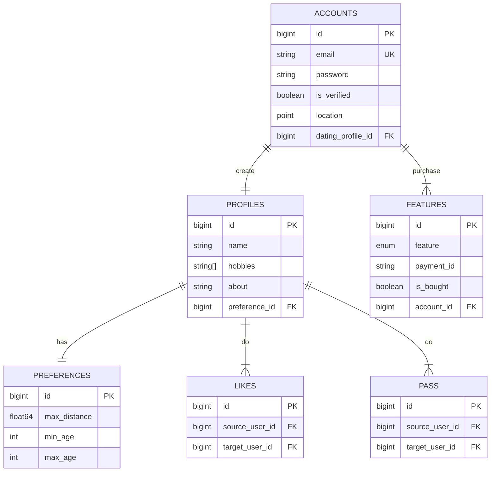

#### PostgreSQL query
    PQ1. F1/F3. SELECT accounts WHERE email = {email}
    PQ2. F1. UPDATE accounts SET password = {hashedPassword} WHERE email = {email}
    PQ3. F2. UPDATE accounts SET is_verified = true WHERE id = {account_id}
    PQ4. F3. UPDATE accounts SET location = {location} WHERE id = {account_id}
    PQ5. F4. UPDATE profiles SET ...profile WHERE id = {profile_id}

#### Redis Datastructure
    R1. Account Verification token
    - type: strings
    - key: account_verification:{token}
    - ttl: 1 hour 

    R2. Login Session
    - type: strings
    - key: login_session:{token}
    - value: {account_id, profile_id, preference_id}
    - ttl: 1 day

    R3. Account Viewed Profile
    - type: sorted sets
    - key: account:{account_id}:viewed_profiles
    - value: {profile_id[]}


#### Redis Query
    RQ1. F1. Create account
    SET R1{token} {account_id} EX 3600

    RQ2. F2. Account Verification token
    GET R1{token}

    RQ3. F3.1. User Login
    SET R2{token} {account_id, profile_id, preference_id}

    RQ4. F3.2 System Authenticate
    GET R2{token}
    
    RQ5. F6/F7. Exclude viewed profile
    ZRANGE R3{account_id} INF (CURRENT_MS() - 1 Day) REV BYSCORE
    
    RQ6. F11. Register profile view
    ZADD R3{account_id} CURRENT_MS() profile_id

#### Elasticsearch Datastructure
```
ED1. F7. index dating_profiles
{
    "_id": 1                // profile.ID
    "account_id": 1         // account.ID
    "preference_id": 1      // preference.ID
    "email": "jane@test.com // account.email
    "location": [1.23, 4.5] // account.location
    "is_verified": true     // account.is_verified
    "name": "Jane"          // profile.name
    "hobbies": ["drawing"]  // profile.hobbies
    "about": "my-about"     // profile.about
    "max_distance: 200      // preferences.max_distance
    "min_age": 25           // preferences.min_age
    "max_age": 27           // preferences.max_age
    "verified_label: true   // features.feature = VERIFIED_LABEL
    "no_swipe_quota: true   // features.feature = NO_SWIPE_QUOTA
}
```

#### Kafka Messages
```
KM1. F7. event account_changed
account {
    ...partial,
    profile {
        ...partial,
        preference {
            ...partial
        }
    },
}
```

### Sequence
#### SD1. F1. POST /accounts
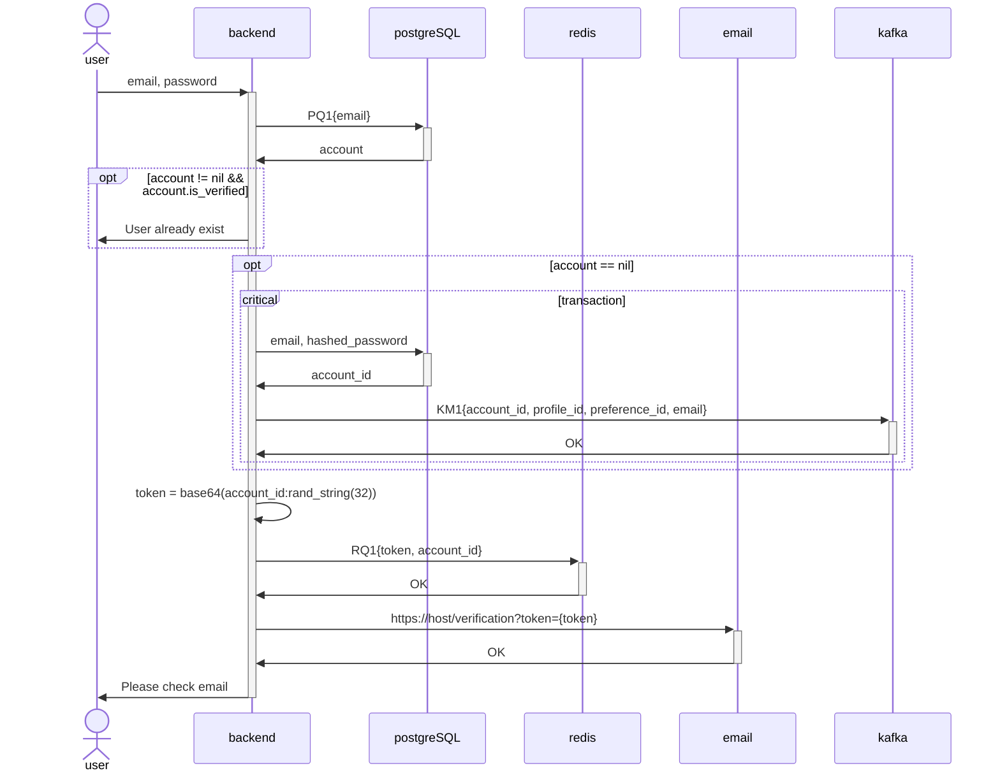

#### SD2. F2. POST /accounts:verify
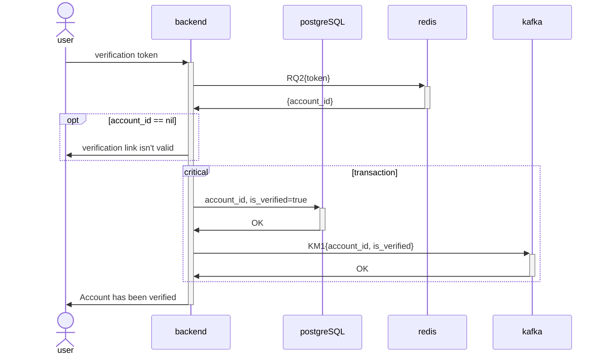

#### SD3. F3.1. POST /accounts:login
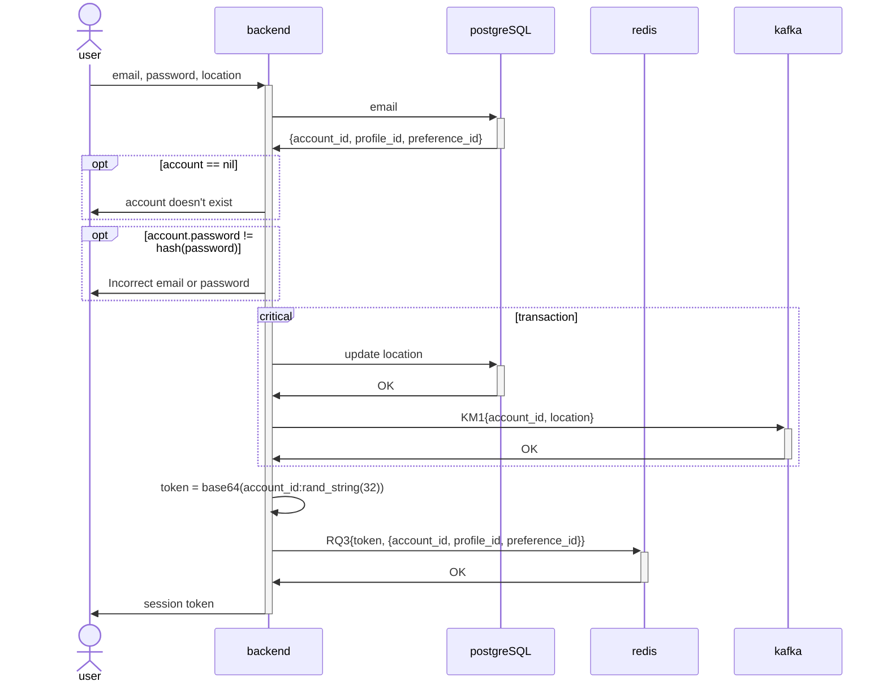

#### SD4. F4. PATCH /accounts/me:dating-profile
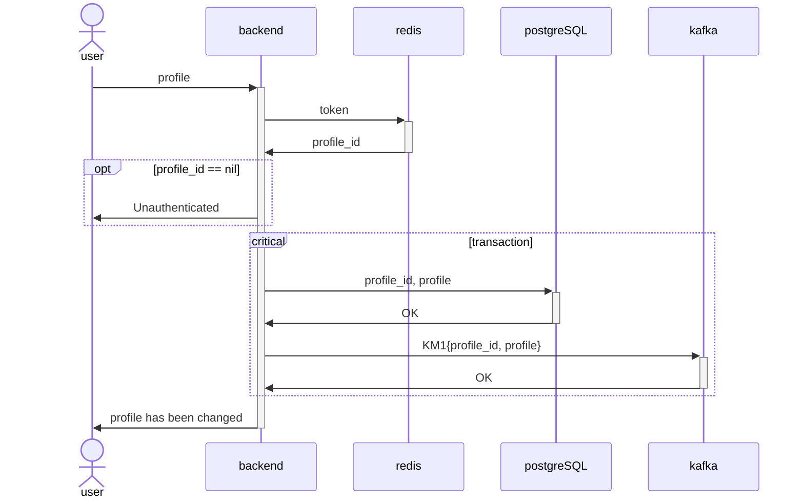

#### SD5. F5. PATCH /accounts/me:dating-preferences
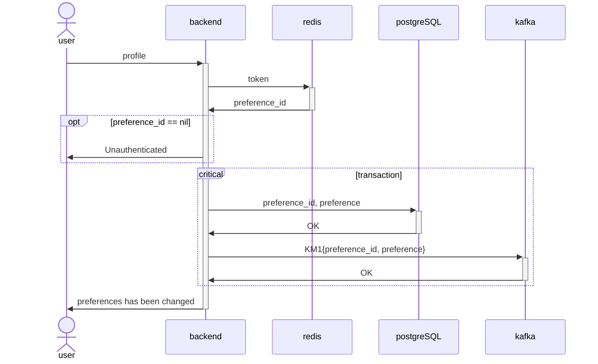

#### SD6. F7. Updating dating-profiles es index (ED1) 
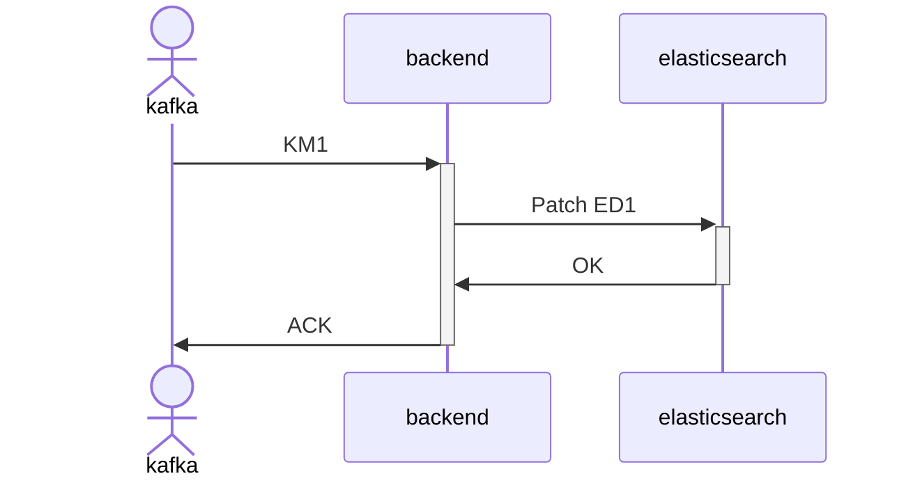

#### SD7. F7. GET /profiles:personalized
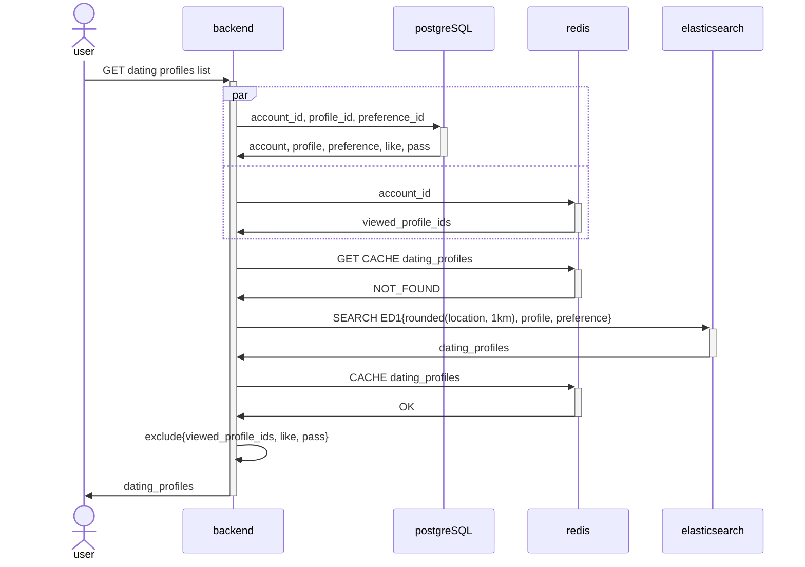

#### SD8. F8. POST /profiles/{profile_id}:pass
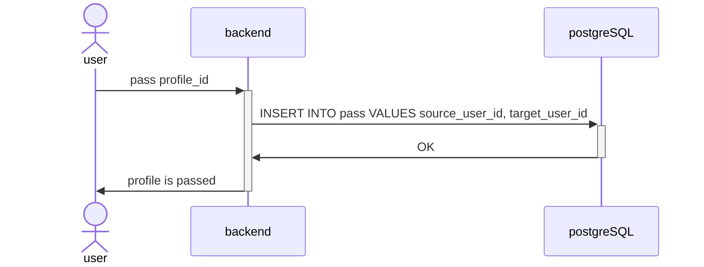

#### F9. POST /profiles/{profile_id}:like
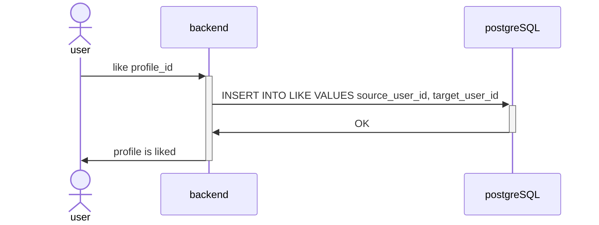

#### F11. POST /profiles/{profile_id}:view
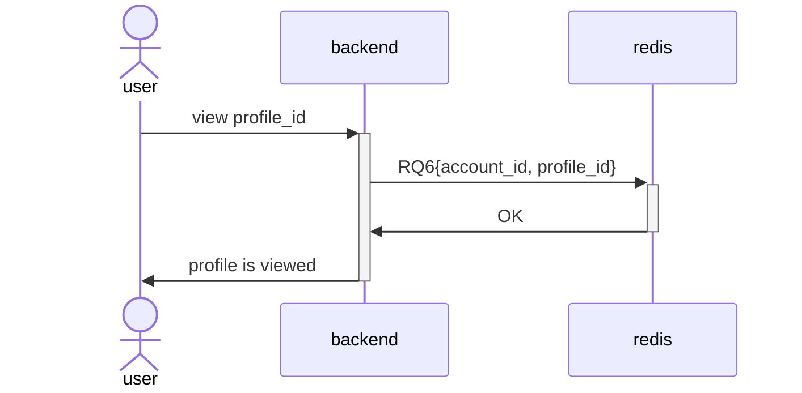

### F12.1. POST /features/{feature_id}:purchase
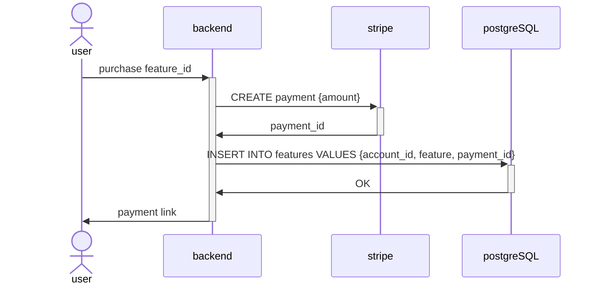

#### F12.2. POST /payments:confirmation
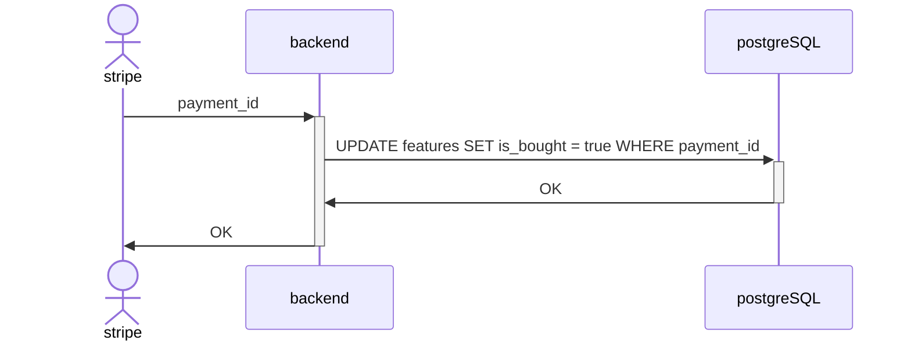

## Tests
### Criteria
    F1. User can create new account with an email
    [ ] Verification link is sent to correct email

    F2. User can verify its newly created account's email
    [ ] text "account has been verified message" appear when verification link is openned

    F3.1. Existing user can login with email and password (Implemented)
    [ ] session token is returned
    
    F3.2. System can authenticate user on authenticated endpoint
    [ ] endpoint with "Authentication" header not returning Unauthenticated status
    [ ] endpoint will return Unauthenticated status when using invalid session token

    F4. Authenticated user can customize their dating profile (OOS but MVP)
    [ ] endpoint return "profile has been changed"
    
    F5. Authenticated user can set their dating preferences (OOS but MVP)
    [ ] endpoint return "preferences has been changed"
    
    F7. Authenticated user can see list of personalized dating profiles (OOS but MVP)
    [ ] endpoint return array of dating profile ranked approximately by distance and user profiles/preferences 

    F8. Authenticated user can pass a dating profile
    [ ] endpoint return "profile is passed" 

    F9. Authenticated user can like a dating profile
    [ ] endpoint return "profile is liked" 

    F10. Regular User is limitted to 10 pass+like per day
    [ ] endpoint return "cannot passed/liked, quota of 10/day is reached" 

    F11. Authenticated user won't be able to see the same dating profile in the same day
    [ ] endpoint exclude viewed profile that day

    F12.1 Regular user can purchase premium packagees which unlock one premium feature of their choosing. The features are:
    - No swipe quota
    - Verified label
    [ ] endpoint return payment link

    F12.2 System can verify the purchase payment
    [ ] endpoint return OK